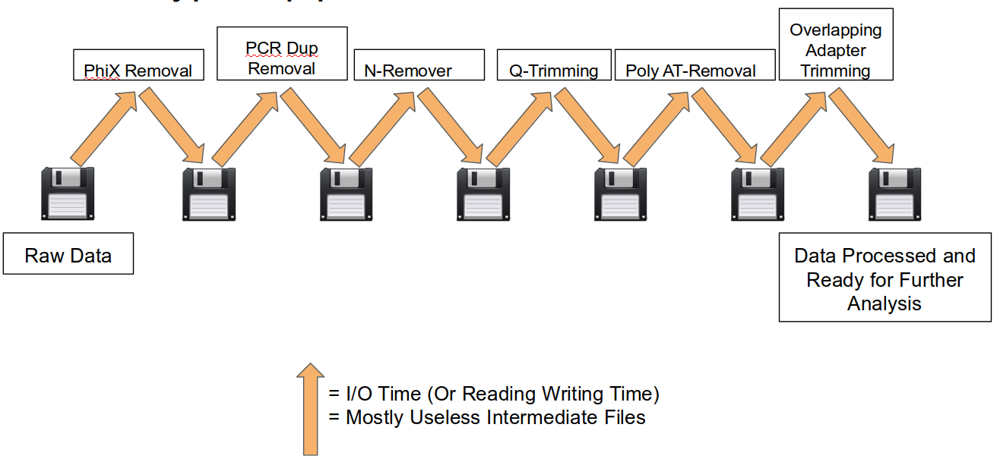
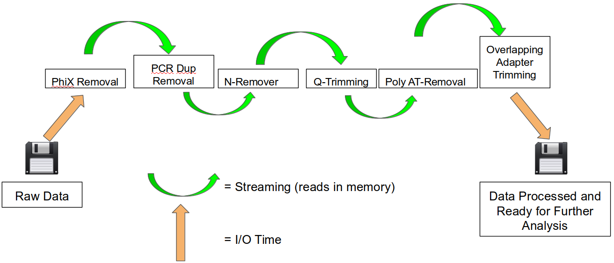
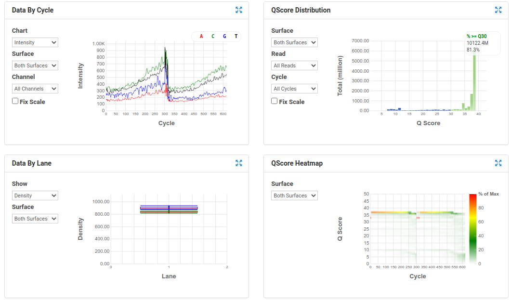
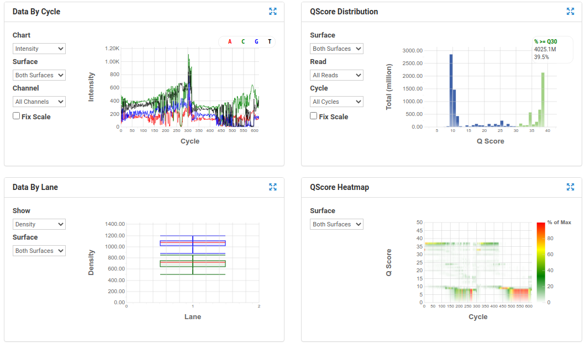

# Sequence Preprocessing

This document assumes [project_setup](./00_project_setup_mm.md) has been completed.

```bash
cd /share/workshop/meta_workshop/$USER/meta_example
```

## Why Preprocess Reads

We have found that aggressively “cleaning” and preprocessing of reads can make a large difference to the speed and quality of mapping and assembly results. Preprocessing your reads means:

  * Removing bases of unwanted sequence (Ex. vectors, adapter, primer sequence, polyA tails).
  * Merge/join short overlapping paired-end reads.
  * Remove low quality bases or N characters.
  * Remove too short reads.

Preprocessing also produces a number of statistics about the samples. These can be used to evaluate sample-to-sample consistency.

### Preprocessing Statistics as QA/QC.

Beyond generating "better" data for downstream analysis, preprocessing statistics also give you an idea as to the original quality and complexity of the sample, library generation features, and sequencing quality.

This can help inform you of how you might change your procedures in the future, either sample preparation, or in library preparation.

We’ve found it best to perform __QA/QC__ on both the run as a whole (poor samples can negatively affect other samples) and on the samples themselves as they compare to other samples (**BE CONSISTENT**).

Reports such as Basespace for Illumina, are great ways to evaluate the run as a whole, the sequencing provider usually does this for you.  

PCA/MDS plots of the preprocessing summary are a great way to look for technical bias across your experiment. Poor quality samples often appear as outliers on the MDS plot and can ethically be removed due to identified technical issues. You should **NOT** see a trend on the MDS plot associated with any experimental factors. That scenario should raise concerns about technical sample processing bias.

**Many technical things happen between original sample and data. Preprocessing is working backwards through that process to get as close as we can to original sample.**


The amount of attention required in preprocessing highly depends on the study goal. For example, if one is aiming to create a high quality metagenome assembled genomes, then the minimum base quality should not be less than 10 or even 20, at the same time the minimum length of the reads should not be too short. If one is aiming to produce taxonomy profiling, then these criteria could be relaxed.


### Preprocessing Workflow

1. Remove contaminants (at least PhiX).
1. Identify and remove any adapter present
1. Join and potentially extend, overlapping paired end reads (RNA reads only)
1. Trim sequences (5’ and 3’) by quality score (I like Q20)
1. Cleanup
  * Remove any reads that are less then the minimum length parameter (50bp for DNA, 30bp for RNA)
  * Produce preprocessing statistics

## HTStream Streamed Preprocessing of Sequence Data

HTStream is a suite of preprocessing applications for high throughput sequencing data (ex. Illumina). A fast C++ implementation, designed with discreet functionality that can be pipelined together using standard Unix piping.

Benefits Include:
  * No intermediate files, reducing storage footprint.
  * Reduced I/O, files are only read in and written out once to disk.
  * Handles both single end and paired end reads at the same time.
  * Applications process reads at the same time allowing for process parallelization.
  * Built on top of mature C++ Boost libraries to reduce bugs and memory leaks.
  * Designed following the philosophy of [Program Design in the UNIX Environment](https://onlinelibrary.wiley.com/doi/abs/10.1002/j.1538-7305.1984.tb00055.x).
  * Works with native Unix/Linux applications such as grep/sed/awk etc.
  * Can build a custom preprocessing pipeline to fit the specific expectation of the data.
  * A single JSON output per sample detailing the preprocessing statistics from each application.

HTStream achieves these benefits by using a tab delimited intermediate format that allows for streaming from application to application. This streaming creates some awesome efficiencies when preprocessing HTS data and makes it fully interoperable with other standard Linux tools.

#### A traditional preprocessing pipeline:




#### An HTStream preprocessing pipline:



This approach also uses significantly less storage as there are no intermediate files. HTStream can do this by streaming a tab-delimited format called tab6.

Single end reads are 3 columns:

`read1id  read1seq  read1qual`

Paired end reads are 6 columns:

`read1id  read1seq  read1qual  read2id  read2seq  read2qual`


### HTStream applications

HTStream includes the following applications:

hts_AdapterTrimmer: Identify and remove adapter sequences.  
hts_CutTrim: Discreet 5' and/or 3' basepair trimming.  
hts_LengthFilter: Remove reads outside of min and/or max length.  
hts_NTrimmer: Extract the longest subsequence with no Ns.    
hts_Overlapper: Overlap paired end reads, removing adapters when present.  
hts_PolyATTrim: Identify and remove polyA/T sequence.  
hts_Primers: Identify and optionally remove 5' and/or 3' primer sequence.  
hts_QWindowTrim: 5' and/or 3' quality score base trimming using windows.  
hts_SeqScreener: Identify and remove/keep/count contaminants (default phiX).  
hts_Stats: Compute read stats.  
hts_SuperDeduper: Identify and remove PCR duplicates.  

The source code and pre-compiled binaries for Linux can be downloaded and installed [from the GitHub repository](https://github.com/s4hts/HTStream).

HTStream is also available on [Bioconda](https://bioconda.github.io/), and there is even an image on [Docker Hub](https://hub.docker.com/r/dzs74/htstream).

HTStream was designed to be extensible. We continue to add new preprocessing routines and welcome contributions from collaborators.

If you encounter any bugs or have suggestions for improvement, please post them to [issues](https://github.com/s4hts/HTStream/issues).

--------

# HTStream tutorial


### <font color='red'> Start Exercise 1: </font>

## Running HTStream

Let's run the first step of our HTStream preprocessing pipeline, which is always to gather basic stats on the read files. For now, we're only going to run one sample through the pipeline.

When building a new pipeline, it is almost always a good idea to use a small subset of the data in order to speed up development. A small sample of reads will take seconds to process and help you identify problems that may have only been apparent after hours of waiting for the full data set to process.


1. Let's start by first taking a small subsample of reads, so that our trial run through the pipeline goes really quickly.

    ```bash
    cd /share/workshop/meta_workshop/$USER/meta_example
    mkdir HTS_testing
    cd HTS_testing
    pwd
    ```

    * *Why run ```pwd``` here?*


    Then create a small dataset.

    ```bash
    zcat ../00-RawData/ANG_301_DNA_1.fastq.gz | head -400000 | gzip > ANG_301_DNA.subset_R1.fastq.gz
    zcat ../00-RawData/ANG_301_DNA_2.fastq.gz | head -400000 | gzip > ANG_301_DNA.subset_R2.fastq.gz
    ls -l
    ```

    So we ```zcat``` (uncompress and send to stdout), pipe ```|```  to ```head``` (param -400000) then pipe to ```gzip``` to recompress and name our files subset.

    * *How many reads are we going to analyze in our subset?*

1. Now we'll run our first preprocessing step ```hts_Stats```, first loading the module and then looking at help.

    ```bash
    cd /share/workshop/meta_workshop/$USER/meta_example/HTS_testing
    module load htstream/1.3.2
    hts_Stats --help
    ```

    * *What version of hts_Stats is loaded?*


1. Now lets run ```hts_Stats``` and look at the output.

    ```bash
    hts_Stats -1 ANG_301_DNA.subset_R1.fastq.gz \
              -2 ANG_301_DNA.subset_R2.fastq.gz \
              -L ANG_301_DNA.stats.json > out.tab
    ```

    * *What happens if you run hts_Stats without piping output to out.tab?*

    * *Can you think of a way to view the output from hts_Stats in __less__ without creating out.tab?*

    By default, all HTS apps output tab formatted files to the stdout.

    Take a look at the output (remember ```q``` quits):
    ```bash
    less out.tab
    ```

    The output was difficult to understand, lets try without line wrapping (note that you can also type ```-S``` from within ```less``` if you forget). Scroll with the arrow keys, left, right, up, and down.
    ```bash
    less -S out.tab
    ```

    And delete out.tab since we are done with it:
    ```bash
    rm out.tab
    ```

    Remember how this output looks, we will revisit it later.

1. Now lets change the command slightly.
    ```bash
    hts_Stats -1 ANG_301_DNA.subset_R1.fastq.gz \
              -2 ANG_301_DNA.subset_R2.fastq.gz \
              -L ANG_301_DNA.stats.json -f ANG_301_DNA.stats
    ```

    * *What parameters did we use, what do they do?*

    Lets take a look at the output of stats

    ```bash
    ls -lah
    ```

    <div class="output">
    total 23M
    drwxrwsr-x 2 jli workshop    7 Dec  8 20:09 .
    drwxrwsr-x 7 jli workshop    7 Dec  8 20:07 ..
    -rw-rw-r-- 1 jli workshop  42K Dec  8 20:09 ANG_301_DNA.stats.json
    -rw-rw-r-- 1 jli workshop 5.7M Dec  8 20:09 ANG_301_DNA.stats_R1.fastq.gz
    -rw-rw-r-- 1 jli workshop 5.8M Dec  8 20:09 ANG_301_DNA.stats_R2.fastq.gz
    -rw-rw-r-- 1 jli workshop 5.7M Dec  8 20:08 ANG_301_DNA.subset_R1.fastq.gz
    -rw-rw-r-- 1 jli workshop 5.8M Dec  8 20:08 ANG_301_DNA.subset_R2.fastq.gz
    </div>

    * *Which files were generated from hts\_Stats?*
    * *Did stats change any of the data (are the contents of ANG_301_DNA.stats_R1.fastq.gz identical to ANG_301_DNA.subset_R1.fastq.gz)?*

1. Lets look at the file **ANG_301_DNA.stats.json**

    ```bash
    less -S ANG_301_DNA.stats.json
    ```

    The logs generated by htstream are in [JSON](https://en.wikipedia.org/wiki/JSON) format, like a database format but meant to be readable.


### Using HTStream to remove PhiX.

[PhiX Control v3](https://www.illumina.com/products/by-type/sequencing-kits/cluster-gen-sequencing-reagents/phix-control-v3.html) is a common control in Illumina runs, and facilities may not tell you if/when PhiX has been spiked in. Since it does not have a barcode, in theory should not be in your data.

However:
* When we know PhiX has been spiked in, we find sequence every time.
    * [update] When dual matched barcodes are used, then almost zero phiX reads can be identified.
* When we know that PhiX has not been spiked in, we rarely find matching sequence.

For RNAseq and variant analysis (any mapping based technique) it is not critical to remove, but for sequence assembly it is (and will often assemble into a full-length PhiX genome). Unless you are sequencing PhiX, it is noise, so its better safe than sorry to screen for it every time.


1. First, view the help documentation for hts_SeqScreener

    ```bash
    cd /share/workshop/meta_workshop/$USER/meta_example/HTS_testing
    hts_SeqScreener -h
    ```

1. Run HTStream on the small test set.

    ```bash
    hts_SeqScreener -1 ANG_301_DNA.subset_R1.fastq.gz \
                    -2 ANG_301_DNA.subset_R2.fastq.gz \
                    -L ANG_301_DNA.phix.json -f ANG_301_DNA.phix
    ```

    * *Which files were generated from hts\_SeqScreener?*

    * *Take look at the file ANG_301_DNA.phix.json*

    * *How many reads were identified as PhiX?*

    * *What fraction of reads were identified as PhiX, do you think cleanup worked well for this sample?*

### Getting more advanced: Streaming multiple applications together

1. Lets try it out. First run hts_Stats and then hts_SeqScreener in a streamed fashion.

    ```bash
    cd /share/workshop/meta_workshop/$USER/meta_example/HTS_testing

    hts_Stats -1 ANG_301_DNA.subset_R1.fastq.gz \
              -2 ANG_301_DNA.subset_R2.fastq.gz \
              -L ANG_301_DNA.streamed.json |
    hts_SeqScreener -A ANG_301_DNA.streamed.json \
              -f ANG_301_DNA.streamed
    ```

    Note the pipe, ```|```, between the two applications!

    **Questions**
    * *What new parameters did we use here?*

    * *What parameter is SeqScreener using that specifies how reads are input?*

    * *Look at the file ANG_301_DNA.streamed.json*

        * *Can you find the section for each program?*

        * *Were the programs run in the order you expected?*

        * *Check the JSON file that is produced. Were any PhiX reads identified?

### <font color='red'> Stop Group Exercise 1 </font>

--------

## The preprocessing pipeline

1. hts_Stats: get stats on *input* raw reads
1. hts_SeqScreener: remove PhiX
1. hts_AdapterTrimmer: identify and remove adapter sequence
1. hts_Overlapper: overlap paired end reads (RNA data only)
1. hts_QWindowTrim: remove poor quality bases
1. hts_LengthFilter: use to remove all reads < 50bp for DNA data and < 30bp for RNA data
1. hts_Stats: get stats on *output* cleaned reads

------

### Adapter trimming by overlapping reads.

Consider the three scenarios below

**Insert size > length of the number of cycles**


hts_AdapterTrimmer product: original pairs

hts_Overlapper product: original pairs

**Insert size < length of the number of cycles (10bp min)**


hts_AdapterTrimmer product: original pairs

hts_Overlapper product: extended, single

**Insert size < length of the read length**


hts_AdapterTrimmer product: adapter trimmed, pairs

hts_Overlapper product: adapter trimmed, single

Both hts_AdapterTrimmer and hts_Overlapper employ this principle to identify and remove adapters for paired-end reads. For paired-end reads the difference between the two are the output, as overlapper produces single-end reads when the pairs overlap and adapter trimmer keeps the paired end format. For single-end reads, adapter trimmer identifies and removes adapters by looking for the adapter sequence, where overlapper just ignores single-end reads (nothing to overlap).


### You can do a quick check for evidence of Illumina sequencing adapters using basic Linux commnads

Remember that Illumina reads must have P5 and P7 adapters and generally look like this (in R1 orientation):

```code
P5---Index-Read1primer-------INSERT-------Read2primer--index--P7(rc)
                     |---R1 starts here-->
```

This sequence is P7(rc): **AGATCGGAAGAGCACACGTCTGAACTCCAGTCA**. It should present in any R1 that contains a full-length adapter sequence. It is easy to search for this sequence using zcat and grep:

```bash
cd /share/workshop/meta_workshop/$USER/meta_example/HTS_testing
zcat ANG_301_DNA.subset_R1.fastq.gz | grep GATCGGAAGAGCACACGTCTGAA
```

----

### Q-window trimming.

As a sequencing run progresses the quality scores tend to get worse. Quality scores are essentially a guess about the accuracy of a base call, so it is common to trim of the worst quality bases.


This is how reads commonly look, they start at "good" quality, increase to "excellent" and degrade to "poor", with R2 always looking worse (except when they don't) than R1 and get worse as the number of cycles increases.

hts_QWindowTrim trims 5' and/or 3' end of the sequence using a windowing (average quality in window) approach.


### Lets put it all together

### <font color='red'> Start Group Exercise 2 </font>

--------

```bash
cd /share/workshop/meta_workshop/$USER/meta_example/HTS_testing

hts_Stats -L ANG_301_DNA_htsStats.json -N "initial stats" \
    -1 ANG_301_DNA.subset_R1.fastq.gz \
    -2 ANG_301_DNA.subset_R2.fastq.gz | \
hts_SeqScreener -A ANG_301_DNA_htsStats.json -N "screen phix" | \
hts_AdapterTrimmer -A ANG_301_DNA_htsStats.json -N "trim adapters" | \
hts_QWindowTrim -A ANG_301_DNA_htsStats.json -N "quality trim the ends of reads" | \
hts_LengthFilter -A ANG_301_DNA_htsStats.json -N "remove reads < 50bp" \
    -n -m 50 | \
hts_Stats -A ANG_301_DNA_htsStats.json -N "final stats" \
    -f ANG_301_DNA.htstream
```

Note the patterns:
* In the first routine we use -1 and -2 to specify the original reads.
* In the final routine -f fastq prefix to write out new preprocessed reads.
* For the log, we specify -L in the first app to write out to a new log, and then use -A for the second routine onward to append log output, generating a single log file at the end.
* All other parameters are algorithm specific, can review using --help

**Questions**
* *Review the final json output, how many reads do we have left?*

* *Confirm that number by counting the number of reads in the final output files.*

* *How many reads had adapters that were cut off?*

* *How many PCR duplicates were there?*

* *Anything else interesting?*

## Run HTStream on the Project.

We can now run the preprocessing routine across all samples on the real data using a SLURM script, [hts_preproc.slurm](../software_scripts/scripts/hts_preproc.slurm), that we should take a look at now.

```bash
cd /share/workshop/meta_workshop/$USER/meta_example/scripts  # We'll run this from the main directory
wget https://ucdavis-bioinformatics-training.github.io/2021-December-Metagenomics-and-Metatranscriptomics/software_scripts/scripts/hts_preproc.slurm
less hts_preproc.slurm
```

When you are done, type "q" to exit.

<div class="script">#!/bin/bash
#SBATCH --nodes=1
#SBATCH --ntasks=1
#SBATCH --cpus-per-task=7
#SBATCH --time=0-10
#SBATCH --mem=20000 # Memory pool for all cores (see also --mem-per-cpu)
#SBATCH --reservation=meta_workshop
#SBATCH --account=workshop
#SBATCH --partition=production
#SBATCH --output=slurmout/hts_%A_%a.out # File to which STDOUT will be written
#SBATCH --error=slurmout/hts_%A_%a.err # File to which STDERR will be written


start=`date +%s`
hostname

export baseP=/share/workshop/meta_workshop/$USER/meta_example
export seqP=$baseP/00-RawData
export cwd=$baseP/scripts

SAMPLE=`head -n ${SLURM_ARRAY_TASK_ID} samples.txt | tail -1 `
TYPE=$1

echo $SAMPLE
echo $TYPE
export outdir=$baseP/01-HTS_Preproc/$TYPE

if [ ! -e $outdir ]; then
    mkdir -p $outdir
fi

if [ ! -e "$outdir/$SAMPLE" ]; then
    mkdir -p $outdir/$SAMPLE
fi

module load htstream/1.3.2

if [ $TYPE == "DNA" ]
then
  call="hts_Stats -L $outdir/$SAMPLE/$SAMPLE.stats.log \
      -1 $seqP/${SAMPLE}_${TYPE}_1.fastq.gz -2 $seqP/${SAMPLE}_${TYPE}_2.fastq.gz | \
      hts_SeqScreener -A $outdir/$SAMPLE/$SAMPLE.stats.log | \
      hts_AdapterTrimmer -A $outdir/$SAMPLE/$SAMPLE.stats.log | \
      hts_QWindowTrim -A $outdir/$SAMPLE/$SAMPLE.stats.log | \
      hts_LengthFilter -m 50 -A $outdir/$SAMPLE/$SAMPLE.stats.log | \
      hts_Stats -f $outdir/$SAMPLE/${SAMPLE}_${TYPE}.cleaned -A $outdir/$SAMPLE/$SAMPLE.stats.log"
else
  call="hts_Stats -L $outdir/$SAMPLE/$SAMPLE.stats.log \
      -1 $seqP/${SAMPLE}_${TYPE}_1.fastq.gz -2 $seqP/${SAMPLE}_${TYPE}_2.fastq.gz | \
      hts_SeqScreener -A $outdir/$SAMPLE/$SAMPLE.stats.log | \
      hts_AdapterTrimmer -A $outdir/$SAMPLE/$SAMPLE.stats.log | \
      hts_Overlapper -o 10 -A $outdir/$SAMPLE/$SAMPLE.stats.log | \
      hts_QWindowTrim -A $outdir/$SAMPLE/$SAMPLE.stats.log | \
      hts_LengthFilter -m 30 -A $outdir/$SAMPLE/$SAMPLE.stats.log | \
      hts_Stats -f $outdir/$SAMPLE/${SAMPLE}_${TYPE}.cleaned -A $outdir/$SAMPLE/$SAMPLE.stats.log"
fi


echo $call
eval $call

end=`date +%s`
runtime=$((end-start))
echo Runtime: $runtime seconds


</div>


Double check to make sure that slurmout and 01-HTS_Preproc directories have been created for output, then after looking at the script, let's run it.

```bash
cd /share/workshop/meta_workshop/$USER/meta_example/
mkdir -p scripts/slurmout  # -p tells mkdir not to complain if the directory already exists
mkdir -p 01-HTS_Preproc
cd scripts
sbatch -J ${USER}.dna --array=1-48 hts_preproc.slurm DNA  # DNA samples
sbatch -J ${USER}.rna --array=1-48 hts_preproc.slurm mRNA  # RNA samples
```

We can watch the progress of our task array using the 'squeue' command. Takes about 30 minutes to process each sample.

```bash
squeue -u $USER  # use your username
```

### <font color='red'> End Group Exercise 2 </font>

## Quality Assurance - Preprocessing statistics as QA/QC.

Beyond generating "better" data for downstream analysis, cleaning statistics also give you an idea as to the original quality and complexity of the sample, library generation, and sequencing quality.

The first step in this process is to talk with your sequencing provider to ask about run level quality metrics. The major sequencing platforms all provide quality metrics that can provide insight into whether things might have gone wrong during library preparation or sequencing. Sequencing providers often generate reports and provide them along with the sequencing data.

### BaseSpace Plots for Illumina data



A nice run showing fairly random distribution of bases per cycle, > 80% bases above Q30, good cluster density and high pass filter rate, and very little drop off in read quality even at the end of the read.  



A poor run showing less base diversity, only 39% bases above Q30, potentially too high cluster density and low pass filter rate, and extreme drop off in read quality after ~100bp of R1, and an even worse profile in R2.  

Results like those above can help inform you of how you might change your protocol/procedures in the future, either sample preparation, or in library preparation.  

The next step is to consider quality metrics for each sample. The key consideration is that **(SAMPLES SHOULD BE CONSISTENT!)**. Plots of the preprocessing summary statistics are a great way to look for technical bias and/or batch effects (RNA samples are more affected by batch effects) within your experiment. Poor quality samples often appear as outliers and can ethically be removed due to identified technical issues.  

The JSON files output by HTStream provide this type of information.


### <font color='red'> Begin Group Exercise 3 </font>

1. Let's make sure that all jobs completed successfully.

    First check all the "htstream_\*.out" and "htstream_\*.err" files:

    ```bash
    cd /share/workshop/meta_workshop/$USER/meta_example/scripts
    cat slurmout/htstream_*.out
    ```

    Look through the output and make sure you don't see any errors. Now do the same for the err files:

    ```bash
    cat slurmout/htstream_*.err
    ```

    Also, check the output files. First check the number of forward and reverse output files (should be 22 each):

    ```bash
    cd ../01-HTS_Preproc
    ls */*R1* | wc -l
    ls */*R2* | wc -l
    ```

    *Did you get the answer you expected, why or why not?*


    Check the sizes of the files as well. Make sure there are no zero or near-zero size files and also make sure that the size of the files are in the same ballpark as each other:

    ```bash
    ls -lh *

    du -sh *
    ```

    *All of the samples started with the same number of reads. What can you tell from the file sizes about how cleaning went across the samples?*

    **IF for some reason HTStream didn't finish, the files are corrupted or you missed the session, please let one of us know and we will help. You can also copy over the HTStream output.**

    ```bash
    cp -r /share/biocore/workshops/2021-December-Meta/01-HTS_Preproc /share/workshop/meta_workshop/$USER/meta_example/.
    ```

1. Let's take a look at the differences in adapter content between the input and output files. First look at the input file:

    ```bash
    cd /share/workshop/meta_workshop/$USER/meta_example
    zless 00-RawData/ANG_301_DNA.R1.fastq.gz
    ```

    Let's search for the adapter sequence. Type '/' (a forward slash), and then type **AGATCGGAAGAGCACACGTCTGAACTCCAGTCAC** (the first part of the forward adapter). Press Enter. This will search for the sequence in the file and highlight each time it is found. You can now type "n" to cycle through the places where it is found. When you are done, type "q" to exit.

    Now look at the output file:

    ```bash
    zless 01-HTS_Preproc/DNA/ANG_301/ANG_301_DNA_R1.fastq.gz
    ```

    If you scroll through the data (using the spacebar), you will see that some of the sequences have been trimmed. Now, try searching for **AGATCGGAAGAGCACACGTCTGAACTCCAGTCAC** again. You shouldn't find it (adapters were trimmed remember), but rarely is anything perfect. You may need to use Control-C to get out of the search and then "q" to exit the 'less' screen.

    Lets grep for the sequence and get an idea of where it occurs in the raw sequences:

    ```bash
    zcat  00-RawData/ANG_301_DNA.R1.fastq.gz | grep --color=auto  AGATCGGAAGAGCACACGTCTGAACTCCAGTCAC
    ```

    * *What do you observe? Are these sequences useful for analysis?*

    ```bash
    zcat  01-HTS_Preproc/DNA/ANG_301/ANG_301_DNA_R1.fastq.gz | grep --color=auto  AGATCGGAAGAGCACACGTCTGAACTCCAGTCAC
    ```


    Lets grep for the sequence and count occurrences

    ```bash
    zcat  00-RawData/ANG_301_DNA.R1.fastq.gz | grep  AGATCGGAAGAGCACACGTCTGAACTCCAGTCAC | wc -l
    zcat  01-HTS_Preproc/DNA/ANG_301/ANG_301_DNA_R1.fastq.gz | grep  AGATCGGAAGAGCACACGTCTGAACTCCAGTCAC | wc -l
    ```

    * *What is the reduction in adapters found?*

    * *How could you modify the cleaning pipeline in order to remove the remaining sequences?*

--------
## A MultiQC report for HTStream JSON files


Finally lets use [MultiQC](https://multiqc.info/) to generate a summary of our output. Currently MultiQC support for HTStream is in development by Bradley Jenner, and has not been included in the official MultiQC package. If you'd like to try it on your own data, you can find a copy here [https://github.com/s4hts/MultiQC](https://github.com/s4hts/MultiQC).

```bash
## Run multiqc to collect statistics and create a report:
cd /share/workshop/meta_workshop/$USER/meta_example
module load multiqc/htstream.dev0
mkdir -p 02-HTS_multiqc_report/DNA
mkdir -p 02-HTS_multiqc_report/mRNA
multiqc -i HTSMultiQC-cleaning-report -o 02-HTS_multiqc_report/DNA ./01-HTS_Preproc/DNA
multiqc -i HTSMultiQC-cleaning-report -o 02-HTS_multiqc_report/mRNA ./01-HTS_Preproc/mRNA
```

Transfer the two HTSMultiQC-cleaning-report_multiqc_report.html to your computer and open them in a web browser.


Or in case of emergency, download the report we have generated: [HTSMultiQC-cleaning-report_multiqc_report for DNA samples](DNA-HTSMultiQC-cleaning-report_multiqc_report.html), and [HTSMultiQC-cleaning-report_multiqc_report for RNA samples](RNA-HTSMultiQC-cleaning-report_multiqc_report.html)

### <font color='red'> End Group Exercise 3 </font>

<!--
    I've created a small R script to read in each json file, pull out some relevant stats and write out a table for all samples.

    ```/bash
    cd /share/workshop/meta_workshop/$USER/meta_example  # We'll run this from the main directory
    wget https://raw.githubusercontent.com/ucdavis-bioinformatics-training/2021-December-Metagenomics-and-Metatranscriptomics/software_scripts/scripts/summarize_stats.R

    module load R
    R CMD BATCH summarize_stats.R 01-HTS_Preproc/DNA summary_hts_DNA.txt
    R CMD BATCH summarize_stats.R 01-HTS_Preproc/mRNA summary_hts_mRNA.txt
    cat summary_hts_DNA.txt
    ```

    Transfer summarize_hts*.txt to your computer using scp or winSCP, or copy/paste from cat [sometimes doesn't work],  

    For scp try, In a new shell session on your laptop. **NOT logged into tadpole**, and **REMEMBER to change __your_username__ to your own user name on your laptop**.

    ```bash
    mkdir ~/meta_workshop
    cd ~/meta_workshop
    scp your_username@tadpole.genomecenter.ucdavis.edu:/share/workshop/your_username/meta_example/summary_hts*.txt .
    ```

    Open in excel (or excel like application), you may have to move the header column 1 cell to the right, and lets review.

-->
**Questions**
* *Any problematic samples?*

* *Anything else worth discussing?*
