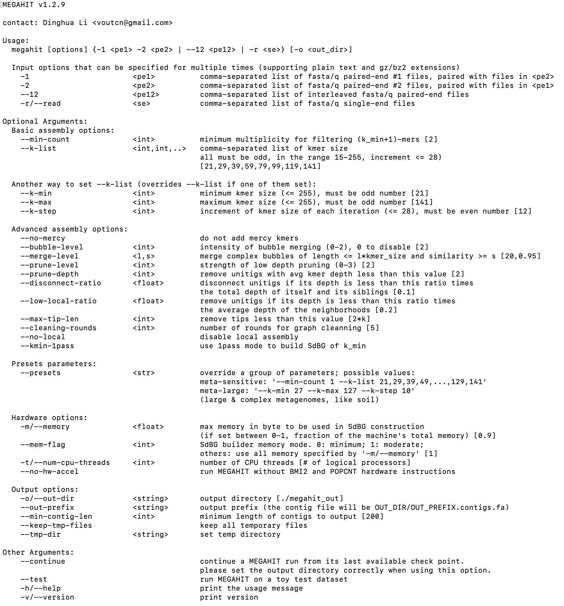

# Metagenomics data analysis
-------------------------------------------------------

This document assumes [preprocessing using HTStream](./01-preproc_htstream_mm.md) has been completed.

The two main objectives in metagenomics data analysis are to answer the questions: __who is there__ and __what can they potentially do__. The first is what we call taxonomic profiling and the second is function profiling.

Taxonomy profiling has traditionally been done using inexpensive 16S rRNA amplicon sequencing. It has limited resolution because of the conservation of the target gene and the length of the amplicon product. It also limits the ability to profile non-bacterial species of a community. In addition, 16S has very limited ability to provide us with the functional capacity of the microbes. Furthermore, [studies](https://www.ncbi.nlm.nih.gov/pmc/articles/PMC4523815/) have shown there might be biases introduced during the amplification step to enrich for rRNA gene and in turn introduces biases in quantification fo taxa.

Shotgun metagenomics approach has gained popularity over the recent years in stuying microbial community. It benefits from the constant decrease in sequencing technology and it allows the study of all microorganisms that are difficult to culture. By sequencing the whole DNA materials from a community, it not only permits the discovery of unknown taxa, but also the ability of predicting the functions of microbial members. We will focus only on the shotgun metagenomics data analysis in this workshop.

---

<p align = "center">

</p>

---

## Remove host DNA

Depending on the sample collection source for microbial studies, there are variable amount of host DNA. For example, bovine rumen samples such as the dataset we are using for this workshop, or fecal samples for gut microbiome studies, or tissue biopsies, all have some leve of host DNA remain. Because host genomes are much larger than the microbiome genomes, the sequencing product will have more host reads than microbial reads. For example, if one sequence the same number of human cells as microbial cells, the sequencing would produce over 99% of human reads. Even when microbiome samples are collected from environment/fields, human contamination happens more than we think. Therefore, removing host/contaminant DNA very important. Especially, when the objective is to produce high quality metagenome assembled genomes. It also reduces biases and minimize false positive associations in downstream analysis.

<p align = "center">

</p>

<p align = "right" style="font-family:Times;font-size:12px;">
Pereira-Marques, etc., 2019, Front. Microbiol. https://doi.org/10.3389/fmicb.2019.01277
</p>

For samples that are suppected to have very high levels of host material, it is worth considering adding a step in the library prep stage to remove host material. I am not going to talk about it because a couple of our lunch sponsors will talk in detail about it. Even with host depletion at the library prep stage, it is important to remove leftover host reads bioinformatically.

[A publication](https://pubmed.ncbi.nlm.nih.gov/32558637/) has done a very thorough study using different software/approaches to detect/remove human reads in microbial datasets. If we are to pick one method, Bowtie2 performs the best overall to remove human reads from the microbial datasets. So, we have chosen to use bowtie2 to remove the host DNA from our dataset.

<p align = "center">

</p>

<p align = "center">

</p>

<p align = "center">

</p>

<p align = "right" style="font-family:Times;font-size:12px;">
Bush, etc., 2020, Microb. Genom. https://doi.org/10.1099/mgen.0.000393
</p>

Based on the findings from the above paper, we are going to use Bowtie2 to remove host bovine DNA. The basic idea is to map/align the preprocessed reads to the bovine reference genome. Then we extract the reads that do not align for downstream analysis. Here we are going to sidetrack a little bit to learn two new concepts: __map/align__ vs __assembly__.


### Mapping vs Assembly

Every organism on earth has its own genome sequence, regardless whether we know how it looks like. The main difference between mapping and assembly is whether we know ahead of time the sequence of the genome. When we have the sequence of a genome and we would like to find out from which genomic locations our sequencing data came from, it uses the mapping approach. On the other hand, when we do not have the sequence of a genome and would like to reconstruct it, assembly approach has to be used. Of course, at the very beginning, we have no idea any of the genome sequences look like, so assembly has to be done first, before a regular mapping approach can be used for further research.

**Assembly** seeks to put together the pieces of fragments that have been sequenced to recreate the genome

- The focus is on the reads, how they can be strung together
- The goal is to reconstruct the genome as best as we can
* Large search space to find the overlapping features
* Regions of similarity (aka repeats)
* Sequencing errors
* For metagenomic assemblies, it is furthur complicated by the unequal representation of members of the community, the presence of closely related microorganisms with similar genomes, the presence of several strains of the same microorganism, as well as the insufficient amount of data for minor community members.

<p align = "center">

</p>


**Mapping** (or alignment to a reference) tries to put together the puzzle pieces directly onto an image of the picture._
- The focus is on the puzzle, regions of the puzzle that contain certain characteristics (ex. what feature) that will help you place the piece onto the puzzle.  
- In mapping the question is more, given a small chunk of sequence, where in the genome did this sequence most likely come from.
- The goal then is to find the match(es) with either the “best” edit distance (smallest difference), or all matches with edit distance less than max edit distance. Main issues are:
* Large search space
* Regions of similarity (aka repeats)
* Gaps (INDELS)
* Complexity (RNA, splicing, transcripts)


#### Aligners/Mappers
Many [alignment algorithms](https://en.wikipedia.org/wiki/List_of_sequence_alignment_software
) to choose from. Examples include:
* Aligners that can ’clip’
  * Bowtie2 in local mode
  * bwa-mem
  * minimap2
  * SNAP
* Aligners that does not allow 'clip'
  * Bowtie2 in end-to-end mode
  
#### Reference Genome

Host/contaminant genome sequence fasta files should be identified at the beginning of analysis.

* Host genome fasta files should include all primary chromosomes, unplaced sequences and un-localized sequences, as well as any organelles and alternative haplotypes.
* If you expect contamination, or the presence of additional sequence/genome, add the sequence(s) to the genome fasta file.

### Hands-on exercise

Now, let's go through the steps to remove host bovine genome. The host genome we use is the more recent version of the bovine genome: ARS-UCD1.2, assembled using both PacBio and Illumina sequencing reads. It has higher quality in terms of contiguity compared to UMD3.1 version of the bovine genome, which was assembled using Sanger sequencing reads. Usually, there are two major sources for high quality reference genomes: ensembl and NCBI. One may choose either one to download the reference genomes. We are going to skip the downloading, and link to the reference that I have downloaded.

Ahead of aligning the sequencing reads, most aligners/mappers require the generation of index of the genome. This step may take quite a while, depending on the size of the genome. Bovine genome is 2.7Gb in size, and bowtie2 indexing step takes ~50 minutes using 12 CPUs. In the interest of time, I am providing the [indexing slurm script](../software_scripts/scripts/bowtie2_build.slurm.txt), but we are not going to go through this step in the workshop. Instead, we are going to link the index files that I have generated.


#### <font color='red'> Start Exercise 1: </font>


```bash
cd /share/workshop/meta_workshop/$USER/meta_example/References
ln -s /share/workshop/meta_workshop/jli/meta_example/References/GCF_002263795.1_ARS-UCD1.2_genomic* .
ls
```


The next step, we are going to download the [alignment script](../software_scripts/scripts/bowtie2_rmhost.slurm.txt) to our scripts directory.

```bash
cd /share/workshop/meta_workshop/$USER/meta_example/scripts
wget https://ucdavis-bioinformatics-training.github.io/2021-December-Metagenomics-and-Metatranscriptomics/software_scripts/scripts/bowtie2_rmhost.slurm
```

Let's take a look at this script. Please recall what we are trying to achieve: **remove the reads that originated from the host and obtain the reads that belong to the microbial community for downstream analysis**.

<div class="script">#!/bin/bash
#SBATCH --nodes=1
#SBATCH --ntasks=1
#SBATCH --cpus-per-task=12
#SBATCH --time=1-12
#SBATCH --mem=30000 # Memory pool for all cores (see also --mem-per-cpu)
#SBATCH --partition=production
#SBATCH --reservation=meta_workshop
#SBATCH --account=workshop
#SBATCH --output=slurmout/btr_%A_%a.out # File to which STDOUT will be written
#SBATCH --error=slurmout/btr_%A_%a.err # File to which STDERR will be written


start=`date +%s`
hostname

export baseP=/share/workshop/meta_workshop/$USER/meta_example
export refP=$baseP/References
export outP=$baseP/02-DNA-rmhost-test

SAMPLE=`head -n ${SLURM_ARRAY_TASK_ID} samples.txt | tail -1 `
TYPE=$1

echo $SAMPLE
echo $TYPE
export seqP=$baseP/01-HTS_Preproc/$TYPE

if [ ! -e $outP ]; then
    mkdir -p $outP
fi

if [ ! -e "$outP/$SAMPLE" ]; then
    mkdir -p $outP/$SAMPLE
fi

module load bowtie2/2.4.2
module load bedtools2/2.29.2
module load samtools/1.11

nbt=$(( ${SLURM_CPUS_PER_TASK} - 4 ))
echo ${nbt}

## -f 12: extract only alignments with both reads unmapped
## -F 256: Do not extract alignments which are not primary alignment
call="bowtie2 -x $refP/GCF_002263795.1_ARS-UCD1.2_genomic \
	-1 <(zcat $seqP/${SAMPLE}/${SAMPLE}_DNA_R1.fastq.gz) -2 <(zcat $seqP/${SAMPLE}/${SAMPLE}_DNA_R2.fastq.gz) \
	-q --phred33 --sensitive --end-to-end \
	-p ${nbt} |samtools view -bh - |samtools view -bh -f 12 -F 256 - |samtools sort -n - | \
	bedtools bamtofastq -i - -fq $outP/${SAMPLE}/${SAMPLE}_hostrmvd_R1.fastq -fq2 $outP/${SAMPLE}/${SAMPLE}_hostrmvd_R2.fastq"


echo $call
eval $call

end=`date +%s`
runtime=$((end-start))
echo Runtime: $runtime seconds


</div>

To submit the jobs. In the interest of time, we are only going to run this step for 4 samples. But do not worry, we will use the results I have generated for later analysis.

```bash
sbatch -J btr.${USER} --array=1-4 bowtie2_rmhost.slurm DNA
squeue -u ${USER}
```


Once the jobs are finished, we should have two fastq files in each sample folder inside 02-DNA-rmhost-test. We will collect two numbers: the total number of reads after preprocessing, and the percentage of the reads that align to the host genome, from the standard error files of each job. Consistence is what we are looking for and it also allows us to make the decision to sequence more or not.

```bash
cd /share/workshop/meta_workshop/$USER/meta_example/scripts
mkdir -p ../metrics
echo -e "Samples\tTotal_reads_after_preproc\tHost_reads_percentage" > ../metrics/host.ratio.txt

for i in {1..4}
do
  sample=$(sed "${i}q;d" samples.txt)
  innum=$(egrep "reads; of these" slurmout/btr_*_${i}.err |cut -d' ' -f1 - )
  num=$(egrep "overall alignment rate" slurmout/btr_*_${i}.err |cut -d' ' -f1 - )
  echo -e "${sample}\t${innum}\t${num}" >> ../metrics/host.ratio.txt
done

```
#### <font color='red'> End Exercise 1: </font>

The file generated by above commands for all samples is [here](./results/host.ratio.txt). The percentage of reads that have been mapped to the host genome is very low for this experiment. However, this number can vary wildly from experiment to experiment. We have seen samples that have over 99.9% of reads that belong to the host. The major factor that affect this number is the source of the samples. When host DNA contamination is a major concern for an experiment, there are kits available from several companies that perform host DNA depletion: Zymo HostZero microbial DNA kit, QIAamp DNA Microbiome kit, NEBNext Microbiome DNA Enrichment kit, Molzym Ultra-Deep Microbiome Prep, ...


At the end of this step, we have successfully removed the host DNA and the resulting reads are ready for downstream analysis.

---

## Taxonomy profiling using Kraken2 and Braken

The first question to answer in a metagenomics study is _who is there_. It is to identify the members of the microbial community. There are two approaches that could be used to achieve this goal: the first is to utilize the reads and the other is to assemble the metagenomes before using homology search to the database. We will look at the read based approach in this section. There are three main algorithms to classify the reads to taxa: the first is to do homology search (for example, using blast: MEGAN) of the reads against huge reference databases, the second is k-mer based and the third is marker gene based. In this step, we are going to focus on the k-mer based classification.

### Kraken2 classification

K-mer based methods count the k-mer frequency of the reads, and compare it to a model trained with sequences from known genomes. There are a few tools belong to this group of method: Kraken, Centrifuge, [Kraken2](https://genomebiology.biomedcentral.com/articles/10.1186/s13059-019-1891-0), [Clark](https://bmcgenomics.biomedcentral.com/articles/10.1186/s12864-015-1419-2), [Kaiju](https://www.nature.com/articles/ncomms11257).

<p align = "center">

</p>

<p align = "right" style="font-family:Times;font-size:12px;">
Wood & Salzberg, 2014, Genome Biol 15, R46, https://doi.org/10.1186/gb-2014-15-3-r46
</p>

Using the algorithm depicted above, the result from Kraken2 is a classification for each read in our fastq files. 

In order to run Kraken2, one has to build corresponding database first, the command to build the standard Kraken2 database is _kraken2-build --standard --threads 24 --db kraken.db_. This will download NCBI taxonomic information, as well as the complete genomes in RefSeq for the bacterial, archaeal, and viral domains, along with the human genome and a collection of known vectors (UniVec_Core). The build process is the most time-consuming, so we are not going to perform it in this workshop. We will link to the Kraken database Nik has created.

#### <font color='red'> Start Exercise 2: </font>

First, let's get ready for this step. We will link to the results that I generated from the last step (by running bowtie2_rmhost.slurm) and download the slurm script for this step.


```
cd /share/workshop/meta_workshop/$USER/meta_example/
ln -s /share/biocore/joshi/projects/workshops/metagenomics_example/ref/krakendb References/.
ln -s /share/workshop/meta_workshop/jli/meta_example/02-DNA-rmhost .
cd /share/workshop/meta_workshop/$USER/meta_example/scripts
wget https://ucdavis-bioinformatics-training.github.io/2021-December-Metagenomics-and-Metatranscriptomics/software_scripts/scripts/kraken2.slurm
```

Let's take a look at this script.

<div class="script">#!/bin/bash
#SBATCH --nodes=1
#SBATCH --ntasks=1
#SBATCH --cpus-per-task=24
#SBATCH --time=1-12
#SBATCH --mem=80000 # Memory pool for all cores (see also --mem-per-cpu)
#SBATCH --partition=production
#SBATCH --reservation=meta_workshop
#SBATCH --account=workshop
#SBATCH --output=slurmout/krk_%A_%a.out # File to which STDOUT will be written
#SBATCH --error=slurmout/krk_%A_%a.err # File to which STDERR will be written


start=`date +%s`
hostname

export baseP=/share/workshop/meta_workshop/$USER/meta_example
export seqP=$baseP/02-DNA-rmhost
export refP=$baseP/References
export outP=$baseP/03-Kraken-test


SAMPLE=`head -n ${SLURM_ARRAY_TASK_ID} samples.txt | tail -1 `

echo $SAMPLE

if [ ! -e "$outP/$SAMPLE" ]; then
    mkdir -p $outP/$SAMPLE
fi

module load kraken2/2.1.2

call="kraken2 --db $refP/krakendb --threads 24 --output $outP/${SAMPLE}/${SAMPLE}.kraken.out --report $outP/${SAMPLE}/${SAMPLE}.kraken_report.out --paired $seqP/${SAMPLE}/${SAMPLE}_hostrmvd_R1.fastq $seqP/${SAMPLE}/${SAMPLE}_hostrmvd_R2.fastq"

echo $call
eval $call

end=`date +%s`
runtime=$((end-start))
echo Runtime: $runtime seconds

</div>


Let's submit some jobs. Kraken2 has improved from the original version of Kraken interms of memory usage and speed, however it still requires a lot of computing resources and time. That is why we will only submit 2 jobs.

```bash
sbatch -J krk.${USER} --array=1-2 kraken2.slurm
squeue -u ${USER}
```

Once Kraken2 successfully finishes, we should have two files in each sample subfolder inside 03-Kraken: _samplename.kraken.out_ and _samplename.kraken_report.out_. Please take a look at the two files and see what they contain.


#### <font color='red'> End Exercise 2: </font>

### Bracken abundance estimation

What Kraken2 has produced is the classification of each read to a taxonomic rank. This result needs to be further refined to generate species (genus, phylum) level abundance table for downstream statistical analysis. This process needs to be done properly. Kraken2 only classifies the reads to the Lowest Common Ancestor (LCA) because there are many genomes present in the database have large fractions of their sequences identical to other genomes. This leads to the result that for well-populated clades with low genome diversity, Kraken only reports species-level assignments for reads from unique regions, while for many species the majority of reads might be classified at a higher level of the taxonomy and the number of reads classified directly to a species may be far lower than the actual number present. Therefore, Kraken's raw read assignments cannot be directly translated into species- or strain-level abundance estimates. Bracken has been designed to perform sophisticated probabilistically re-distribution of reads to estimate the abundance.


<p align = "center">

</p>

<p align = "right" style="font-family:Times;font-size:12px;">
Lu, etc., 2017, PeerJ Computer Science 3:e104, https://doi.org/10.7717/peerj-cs.104
</p>

Bracken takes the output from Kraken and estimate the abundance at user specified level: species, genus, or phylum.

#### <font color='red'> Start Exercise 3: </font>

Let's get ready for this step by linking the results that I have generated and the slurm script.


```
cd /share/workshop/meta_workshop/$USER/meta_example/
ln -s /share/workshop/meta_workshop/jli/meta_example/03-Kraken .
cd /share/workshop/meta_workshop/$USER/meta_example/scripts
wget https://ucdavis-bioinformatics-training.github.io/2021-December-Metagenomics-and-Metatranscriptomics/software_scripts/scripts/bracken.slurm
```

Let's take a look at the script:

<div class="script">#!/bin/bash
#SBATCH --nodes=1
#SBATCH --ntasks=1
#SBATCH --cpus-per-task=24
#SBATCH --time=1-12
#SBATCH --mem=80000 # Memory pool for all cores (see also --mem-per-cpu)
#SBATCH --partition=production
#SBATCH --output=slurmout/brk_%A_%a.out # File to which STDOUT will be written
#SBATCH --error=slurmout/brk_%A_%a.err # File to which STDERR will be written


start=`date +%s`
hostname

export baseP=/share/workshop/meta_workshop/$USER/meta_example
export refP=$baseP/References
export krkP=$baseP/03-Kraken
export outP=$baseP/04-Bracken


SAMPLE=`head -n ${SLURM_ARRAY_TASK_ID} samples.txt | tail -1 `

echo $SAMPLE

if [ ! -e "$outP/$SAMPLE" ]; then
    mkdir -p $outP/$SAMPLE
fi

module load kraken2/2.1.2
module load bracken/2.5

call="bracken -d $refP/krakendb -t 24 -i $krkP/${SAMPLE}/${SAMPLE}.kraken_report.out -l S -o $outP/${SAMPLE}/${SAMPLE}_report_species.txt"

echo $call
eval $call

end=`date +%s`
runtime=$((end-start))
echo Runtime: $runtime seconds

</div>


Let's submit a couple jobs.

```bash
cd /share/workshop/meta_workshop/$USER/meta_example/scripts
sbatch -J brk --array=1-48 bracken.slurm
squeue -u ${USER}
```

This step runs very fast, a few seconds. It generates two files for each sample in its corresponding subdirectory inside 03-Kraken: _samplename_report_species.txt_ and _samplename.kraken_report_bracken.out_. Please take a look at both files to understand what they contain.

Finally, we are going to combine the abundance estimation for each sample into an abundance table.

```bash
cd /share/workshop/meta_workshop/$USER/meta_example/scripts
python /software/bracken/2.5/lssc0-linux/analysis_scripts/combine_bracken_outputs.py --files ../04-Bracken/*/*_report_species.txt -o ../04-Bracken/merged_abundance_species.txt
```

#### <font color='red'> End Exercise 3: </font>

### Differential abundance analysis

In most experiments, the estimation of abundance is to study the difference between conditions to understand how microbial community profile changes. Many packages that were designed for count-based profiling have been used for this purpose, such as DESeq2, edgeR, which were designed for RNASeq analysis originally, but have been used successfully in studing microbial community. There are also some packages developed specifically for meta-omics, such as [MaAsLin2](https://journals.plos.org/ploscompbiol/article?id=10.1371/journal.pcbi.1009442).

We are going to use edgeR/limma for this step and will do the analysis on our laptop. First, let's download [the abundance file](./results/merged_abundance_species.txt), [the metadata file](./results/feed.txt) and the [R markdown file](../software_scripts/scripts/Differential.kraken.Rmd) to our laptop.

Start RStudio and go to the folder that you have downloaded the three files. Then open the R markdown file (Differential.kraken.Rmd). If RStudio has not prompted you to install packages, then please follow the instructions below for installing the packages we need.

In the RStudio console run the following commands
```r
if (!requireNamespace("BiocManager", quietly = TRUE))
  install.packages("BiocManager")

if (!any(rownames(installed.packages()) == "edgeR")){
  BiocManager::install("edgeR")
}
library(edgeR)

if (!any(rownames(installed.packages()) == "dplyr")){
  install.packages("dplyr")
}
library(dplyr)
if (!any(rownames(installed.packages()) == "ggplot2")){
  install.packages("ggplot2")
}
library(ggplot2)
if (!any(rownames(installed.packages()) == "kableExtra")){
  install.packages("kableExtra")
}
library(kableExtra)
```


Now we can generate a report by Knit the Rmd file to HTML. Here is [the report](./results/Differential.kraken.html).

---

## de novo Assembly

The assembly of overlapping reads into continuous or semi-continuous genome fragments offers advantage in sensitive detection of genomic features. It also offers potential of createing complete genomes which could be used as reference for future studies. There are two main categories of assemblers used for de novo assembly, much like for a single organism genome assembly: de Bruijn graph based assemblers and string graph based assemblers. There are many assemblers in each categories.

<p align = "center">

</p>

<p align = "right" style="font-family:Times;font-size:12px;">
Vollmers, etc., 2017, Plos One, https://doi.org/10.1371/journal.pone.0169662
</p>

We are going to use [Megahit](https://pubmed.ncbi.nlm.nih.gov/25609793/) as the assembler. It is ultra-fast and produces good quality assemblies, in particular, it has high flexibility in dealing with different complexity of metagenomics reads.

<p align = "center">

</p>

<p align = "right" style="font-family:Times;font-size:12px;">
Li, etc., 2015, Bioinformatics, https://doi.org/10.1093/bioinformatics/btv033
</p>


First, let's take a look at the help manual of the package.

```bash
module load megahit/1.2.9
megahit --help
```

<p align = "center">

</p>


#### <font color='red'> Start Exercise 4: </font>

Now, let's download the slurm script for megahit and take a look.

```bash
cd /share/workshop/meta_workshop/$USER/meta_example/scripts
wget https://ucdavis-bioinformatics-training.github.io/2021-December-Metagenomics-and-Metatranscriptomics/software_scripts/scripts/megahit.slurm
cat megahit.slurm
```

<div class="script">#!/bin/bash
#SBATCH --nodes=1
#SBATCH --ntasks=1
#SBATCH --cpus-per-task=16
#SBATCH --time=1-12
#SBATCH --mem=80000 # Memory pool for all cores (see also --mem-per-cpu)
#SBATCH --partition=production
#SBATCH --reservation=meta_workshop
#SBATCH --account=workshop
#SBATCH --output=slurmout/mgh_%A_%a.out # File to which STDOUT will be written
#SBATCH --error=slurmout/mgh_%A_%a.err # File to which STDERR will be written


start=`date +%s`
hostname

export baseP=/share/workshop/meta_workshop/$USER/meta_example
export seqP=$baseP/02-DNA-rmhost
export outP=$baseP/03-Megahit-DNA-test

SAMPLE=`head -n ${SLURM_ARRAY_TASK_ID} samples.txt | tail -1 `

echo $SAMPLE

if [ ! -e $outP ]; then
    mkdir -p $outP
fi

# do not create $outP/${SAMPLE}, megahit fails because of existing dir

module load megahit/1.2.9

call="megahit -t ${SLURM_CPUS_PER_TASK} -m 0.4 \
      -1 $seqP/${SAMPLE}/${SAMPLE}_hostrmvd_R1.fastq -2 $seqP/${SAMPLE}/${SAMPLE}_hostrmvd_R2.fastq \
      -o $outP/${SAMPLE} --out-prefix ${SAMPLE}"


echo $call
eval $call

end=`date +%s`
runtime=$((end-start))
echo Runtime: $runtime seconds

</div>

Now, we are ready to submit some assembly jobs.

```bash
cd /share/workshop/meta_workshop/$USER/meta_example/scripts
sbatch -J mgh --array=1-3 megahit.slurm
```

When the jobs finish, please take a look at the files generated by megahit.

#### <font color='red'> End Exercise 4: </font>

I have generated a [summary table](./results/megahit.stats.txt) about the assemblies. 

The quality of the assemblies highly dependent on the complexity of the community, the sequencing depth and the sequencing read length. One may choose to use an iterative pipeline to assemble the reads that are not incorporated in the assembly in previous iteration. Regardless, at the end of this step, it is very rare that one would have perfectly assembled genomes, especially for those community memebers that have low abundance. In the genome assembly for a single organism, there is a scaffolding process that link contigs into larger sequence that approach full genome size. Metagenomic scaffolding in the context of complex community is problematic, despite some useful approaches (such as Phase Genomics' products). The difficult lie in the homologous fragments from very similar genomes can be joined by mistake and lead to assemblies of poor quality. A complementary approach to scaffolding is metagenome binning. The idea is to group contigs from the same organism in the absense of physical linkage information. Binning does not result in more contiguous genomes, but genome bins can contain near complete set of genes from an organism, which is useful for functional studies.

There are two classes of metagenomic binning: taxonomy dependent and taxonomy independent. Taxonomy dependent binning first perform taxonomy classification on each contig using known references then bin contigs having the same labels. This set of tools can be accurate and fast, but they are significantly limited by the availabilit of known genomes. Taxonomy indepdendent binning, instead employ statistical methods to find similarities among the contigs, such as sharing similar sequence composition, or correlate among different samples. Many among this set of tools suffer from low accurary and low scalability when applied to complex communities. MetaBAT was designed to address these issues and have been improved further in [MetaBAT2](https://www.ncbi.nlm.nih.gov/pmc/articles/PMC6662567/). It has been used in many metagenomics studies.

It takes a long time to run MetaBAT2, so I am providing the [script](../software_scripts/scripts/metabat.slurm.txt) for those of you who are interested in learning the process. It involves mapping the sequencing reads to the assembled contigs, calculate coverage information and run binning algorith. Many other methods exist to improve metagenomic binning: [GraphBin2](https://drops.dagstuhl.de/opus/volltexte/2020/12797/). The binning results are usually checked for quality using [CheckM](https://github.com/Ecogenomics/CheckM/wiki/Introduction#about).

The end result of this process are a set of metagenome-assembled genomes (MAGs). There have been many efforts in creating collections MAGs for diverse microbial communities, such as the integrated mouse gut metagenome catalog (iMGMC), Genomes from Earth's Microbiome (GEM) catalog... These serve as databases for future metagenomic studies. One could try to position these MAGs onto the tree of life. One package could be used to perform this task is PhyloPlAn3. Please see an example of a tree for sample ANG_301 [here](./results/tree.png). These MAGs could be annotated using MetaGeneMark.

## Functional profiling

The ability to perform functional profiling using shotgun metagenomic sequencing data is a big advantage comparing to 16S approach. Functional profiling aims to quantify the gene and metabolic pathway content contributed by known and unknown community members. It requires to consider all reads, not just a subset of informative reads used for taxonomic profiling. This adds considerable analytical complexity.

The methods (SUPER-FOCUS, Woods, MetAnnotate, HUMAnN, ...) aim to reconstruct metabolic functions through traslated search of metagenomic sequencing reads. Comparing to nucleotide-level analysis, the limitation of this approach is its speed, even with the more advanced translated search algorithms.

HUMAnA2 incorporated a tiered approach with nucleotide-level search, accelerated translated search and pathway reconstruction components. 

<p align = "center">

</p>

<p align = "right" style="font-family:Times;font-size:12px;">
Franzosa, etc., 2018, Nat Methods, 15, 962-968, https://doi.org/10.1038/s41592-018-0176-y 
</p>

HUMAnN3 is the most recent version of HUMAnN pipeline. It uses UniProt/UniRef 2019_01 sequences and annotations, contains twice more species pangenomes and three time more gene families, comparing to HUMAnN2.

This tool allows us to gain information at function level. However, please keep in mind that this analysis provides the potential functions the community members possess. They should be interpreted differently from the same analysis using metatranscriptomics data.

#### <font color='red'> Start Exercise 5: </font>

The help manual for HUMAnN3 is [here](./metagenome_figures/humann.help.txt). Let's get ready to run HUMAnN3. First, download the script and take a look. 

```bash
cd /share/workshop/meta_workshop/$USER/meta_example/scripts
wget https://ucdavis-bioinformatics-training.github.io/2021-December-Metagenomics-and-Metatranscriptomics/software_scripts/scripts/humann.DNA.slurm
cat humann.DNA.slurm
```

<div class="script">#!/bin/bash
#SBATCH --nodes=1
#SBATCH --ntasks=1
#SBATCH --cpus-per-task=24
#SBATCH --time=0-12
#SBATCH --mem=40000 # Memory pool for all cores (see also --mem-per-cpu)
#SBATCH --partition=production
#SBATCH --reservation=meta_workshop
#SBATCH --account=workshop
#SBATCH --output=slurmout/hmad_%A_%a.out # File to which STDOUT will be written
#SBATCH --error=slurmout/hmad_%A_%a.err # File to which STDERR will be written


start=`date +%s`
hostname

export baseP=/share/workshop/meta_workshop/$USER/meta_example
export seqP=$baseP/02-DNA-rmhost
export outP=$baseP/03-HUMANN-DNA-test
export databaseP=/software/humann/3.0.1/lssc0-linux/db

SAMPLE=`head -n ${SLURM_ARRAY_TASK_ID} samples.txt | tail -1 `

echo $SAMPLE

if [ ! -e $outP/$SAMPLE ]; then
    mkdir -p $outP/$SAMPLE
fi


module load humann/3.0.1

source activate metaphlan-3.0.13

call="cat $seqP/${SAMPLE}/${SAMPLE}_hostrmvd_R1.fastq $seqP/${SAMPLE}/${SAMPLE}_hostrmvd_R2.fastq |gzip - > $outP/${SAMPLE}/${SAMPLE}.fastq.gz"

echo $call
eval $call


call="humann --threads ${SLURM_CPUS_PER_TASK} \
      --input $outP/${SAMPLE}/${SAMPLE}.fastq.gz \
      --pathways metacyc --protein-database $databaseP/uniref --nucleotide-database $databaseP/chocophlan \
      --output $outP/${SAMPLE} --output-basename ${SAMPLE} --o-log  $outP/${SAMPLE}/${SAMPLE}.log"


echo $call
eval $call

end=`date +%s`
runtime=$((end-start))
echo Runtime: $runtime seconds

</div>

Now let's submit two jobs.

```bash
sbatch -J hmad.${USER} --array=1-2 humann.DNA.slurm
squeue -u ${USER}
```

The jobs take about a couple hours to finish. At the same time, you can link to the results I generated and take a look.

```bash
cd /share/workshop/meta_workshop/$USER/meta_example
ln -s /share/workshop/meta_workshop/jli/meta_example/03-HUMANN-DNA .
```

What results have HUMAnN3 generated?

#### <font color='red'> End Exercise 5: </font>

This analysis offers a new angle of looking at our community. One may perform differential analysis on these abundance estimates to understand the functional differences between conditions.

The quantification is RPKs, which are reads-per-kilobase, normalized using gene length. These data are not suitable for differential analysis using edgeR. However, the senior author of edgeR has mentioned that they are working with the HUMAnN team to extract data from HUMAnN pipeline that will be suitable for edgeR/limma-voom. He suggested that the work around in the meantime can be to use log trnasfomed data with limma-trend analysis. We are going to see how it's done.

#### <font color='red'> Start Exercise 6: </font>

First, those RPKs need to be furthur normalized with respect to the sequencing depth. This can be done using a utility script from HUMAnN and then merge all samples to one abundance table.

```bash
cd /share/workshop/meta_workshop/${USER}/meta_example
cp -r /share/workshop/meta_workshop/jli/meta_example/03-HUMANN-DNA .
wget https://ucdavis-bioinformatics-training.github.io/2021-December-Metagenomics-and-Metatranscriptomics/software_scripts/scripts/humann.DNA.norm.slurm
cat humann.DNA.norm.slurm
```

This step runs very fast, so we should all be ablet to have the normalized results soon. Then we are going to merge all samples into one abundance table and download it to our local laptop.

```bash
cd /share/workshop/meta_workshop/jli/meta_example/03-HUMANN-DNA
ln -s */*_genefamilies.tsv .
module load humann/3.0.1
source activate metapholan-3.0.13
