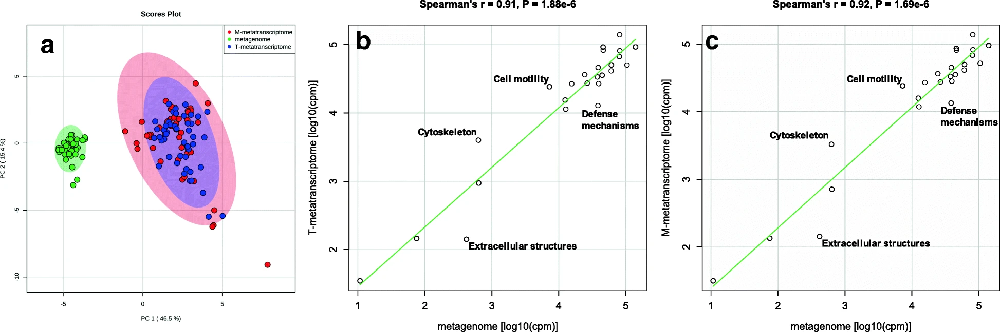
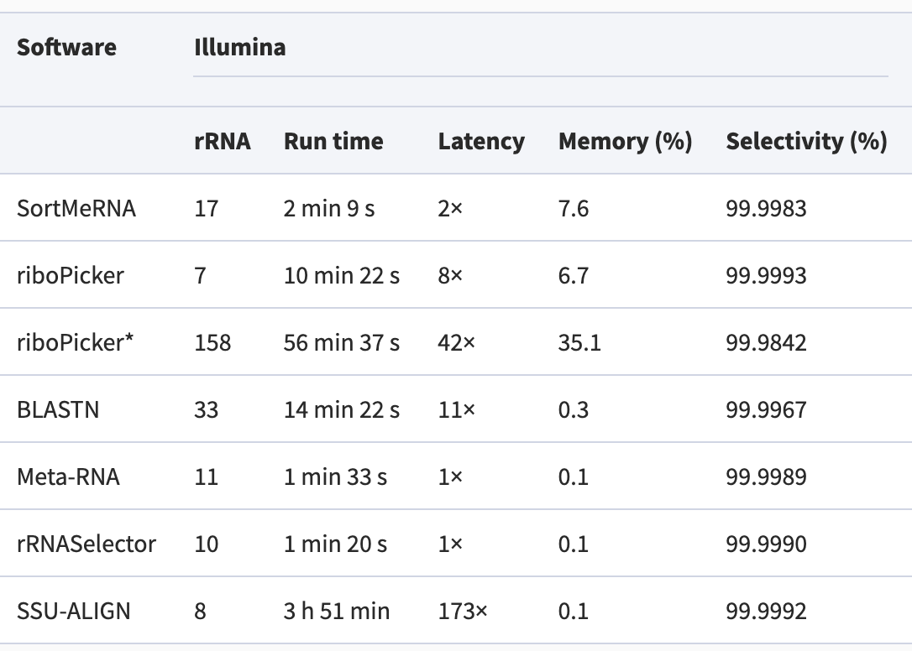
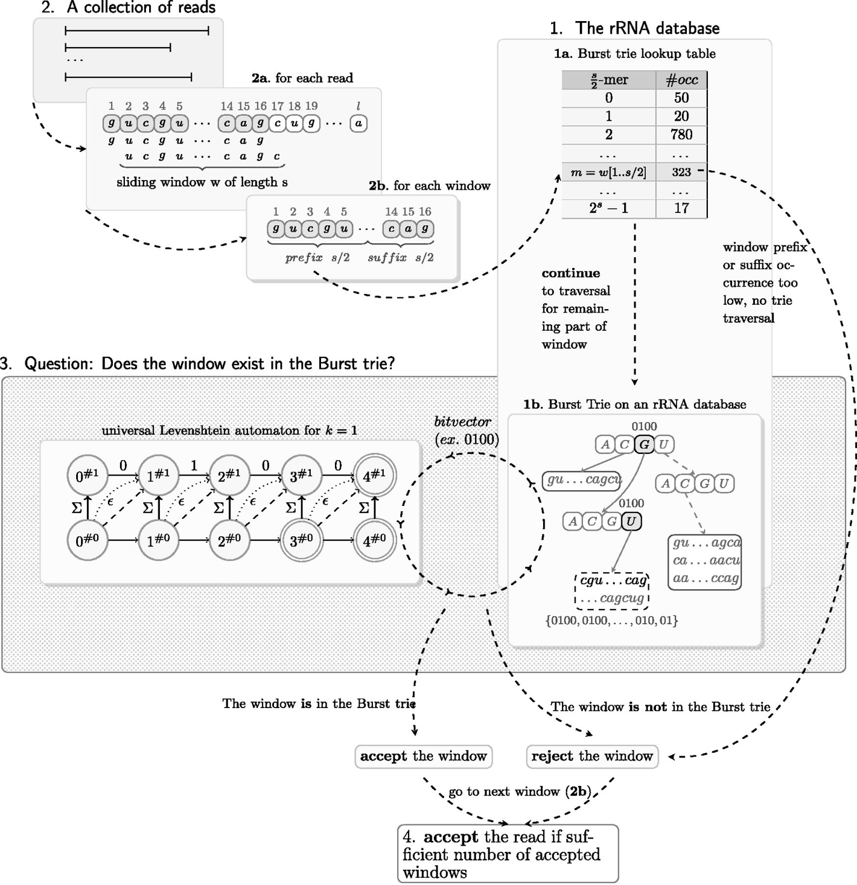

# Metatranscriptomics data analysis
-------------------------------------------------------

This document assumes [preprocessing using HTStream](./01-preproc_htstream_mm.md) has been completed.

The main objectives in metatranscriptomics data analysis is to answer the question:  __what are they doing__. At the same time, it can also answer the question: __who is there__. These two concepts we have seen in the metagenomics data analysis part of this workshop. But we are going to see what is different when we have metatranscriptomics data.

---

<p align = "center">

</p>

---

## Remove/Separate rRNA

Ribosomal RNA is by far the most abundant form of RNA in most cells and can make up to 90% of the sequencing data. They perform essential cellular functions and offer information on a community's structure and have been used in traditional taxonomic profiling of microbial communities. Nonetheless, they do not provide more information on a community. If one is mainly interested in studying the functional units of a microbial community, these rRNA provides little information and takes up the majority of computing resources if not removed.

<p align = "center">

</p>

<p align = "right" style="font-family:Times;font-size:12px;">
Li, etc., Microbiome 7,6 (2019), https://doi.org/10.1186/s40168-019-0618-5
</p>

There are many packages created to perform this task. They all attempt to match the sequencing reads to sequences in rRNA databases. They vary wildly in the requirement for computing resources, but have similar accuracy. We are going to use the more popular package that I have seen: [SortMeRNA](https://academic.oup.com/bioinformatics/article/28/24/3211/246053#83403637).

**Performance comparison among methods:**

<p align = "center">

</p>

**SortMeRNA algorithm:**

<p align = "center">

</p>

<p align = "right" style="font-family:Times;font-size:12px;">
Li, etc., Microbiome 7,6 (2019), https://doi.org/10.1186/s40168-019-0618-5
</p>

In order to remove the rRNA fragements from our reads, we first need to have a database of all rRNA sequences that the software can use to compare our reads to. The one major rRNA database is [SILVA](https://www.arb-silva.de/), which holds quality checked and regularly updated rRNA sequence data. It includes both small (16S/18S)and large (23S/28S) subunit rRNA sequences for Bacteria, Archaea, and Eukarya. [Rfam](https://rfam.xfam.org/) is another RNA resource that has some complementary rRNA sequences (5S, 5.8S). We are going to provide the combination of these rRNA sequences to SortMeRNA to remove any rRNA reads from our data.

#### <font color='red'> Start Exercise 1: </font>

First we are going to skip the step of downloading the rRNA database files, as they are large. Instead, we are going to link to the files that I have downloaded.

```bash
cd /share/workshop/meta_workshop/$USER/meta_example/References
ln -s /share/workshop/meta_workshop/jli/meta_example/References/SILVA* .
ln -s /share/workshop/meta_workshop/jli/meta_example/References/RF00* .
ls
```

Let's load the module for SortMeRNA and take a look at the [help manual](./metatranscriptome_figures/sortmerna.help.txt).

```bash
module load sortmerna/4.3.4
sortmerna --help
```

Let's go back to our _scripts_ directory and download the slurm script to run SortMeRNA.

```bash
cd /share/workshop/meta_workshop/$USER/meta_example/scripts
wget https://ucdavis-bioinformatics-training.github.io/2021-December-Metagenomics-and-Metatranscriptomics/software_scripts/scripts/sortmerna.slurm
cat sortmerna.slurm
```

<div class="script">#!/bin/bash
#SBATCH --nodes=1
#SBATCH --ntasks=1
#SBATCH --cpus-per-task=16
#SBATCH --time=1-12
#SBATCH --mem=30000 # Memory pool for all cores (see also --mem-per-cpu)
#SBATCH --partition=production
#SBATCH --reservation=meta_workshop
#SBATCH --account=workshop
#SBATCH --output=slurmout/srnas_%A_%a.out # File to which STDOUT will be written
#SBATCH --error=slurmout/srnas_%A_%a.err # File to which STDERR will be written


start=`date +%s`
hostname

export baseP=/share/workshop/meta_workshop/$USER/meta_example
export refP=$baseP/References
export outP=$baseP/02-mRNA-rRNArmvd-test

SAMPLE=`head -n ${SLURM_ARRAY_TASK_ID} samples.txt | tail -1 `
TYPE=$1

echo $SAMPLE
echo $TYPE
export seqP=$baseP/01-HTS_Preproc/$TYPE

if [ ! -e $outP ]; then
    mkdir -p $outP
fi

if [ ! -e "$outP/$SAMPLE" ]; then
    mkdir -p $outP/$SAMPLE
fi

module load sortmerna/4.3.4

if [ ${SLURM_ARRAY_TASK_ID} == 2 ]
then
  call="sortmerna --ref $refP/SILVA_138.1_LSURef_NR99_tax_silva_trunc.fasta \
	--ref $refP/SILVA_138.1_SSURef_NR99_tax_silva_trunc.fasta \
	--ref $refP/RF00001.fa --ref $refP/RF00002.fa \
	--reads $seqP/${SAMPLE}/${SAMPLE}_mRNA_R1.fastq.gz \
	--reads $seqP/${SAMPLE}/${SAMPLE}_mRNA_R2.fastq.gz \
	--workdir $outP/${SAMPLE} --fastx --threads ${SLURM_CPUS_PER_TASK} \
	--other $outP/${SAMPLE}/${SAMPLE}"
else
  call="sortmerna --ref $refP/SILVA_138.1_LSURef_NR99_tax_silva_trunc.fasta \
	--ref $refP/SILVA_138.1_SSURef_NR99_tax_silva_trunc.fasta \
	--ref $refP/RF00001.fa --ref $refP/RF00002.fa \
	--reads $seqP/${SAMPLE}/${SAMPLE}_mRNA_SE.fastq.gz \
	--workdir $outP/${SAMPLE} --fastx --threads ${SLURM_CPUS_PER_TASK} \
	--other $outP/${SAMPLE}/${SAMPLE}"
fi

echo $call
eval $call

end=`date +%s`
runtime=$((end-start))
echo Runtime: $runtime seconds

</div>


Now, we are ready to submit a few jobs. The jobs will take about 2 hours to run. But we can link available results over so that we can take a look at what results are generated by SortMeRNA. Pick one sample and see what outputs there are.

```bash
sbatch -J srna.${USER} --array=1-2 sortmerna.slurm mRNA
```

```bash
cd /share/workshop/meta_workshop/$USER/meta_example/
for i in {1..48}
do
  sample=$(sed "${i}q;d" scripts/samples.txt)
  mkdir -p 02-mRNA-rRNArmvd/${sample}
  ln -s /share/workshop/meta_workshop/jli/meta_example/02-mRNA-rRNArmvd/${sample}/${sample}.fq.gz 02-mRNA-rRNArmvd/${sample}/.
  ln -s /share/workshop/meta_workshop/jli/meta_example/02-mRNA-rRNArmvd/${sample}/out 02-mRNA-rRNArmvd/${sample}/.
done
```

Using the following commands, we can generate a [summary file](./results/sortmerna.stats.txt) for the result of SortMeRNA.

```bash
cd /share/workshop/meta_workshop/$USER/meta_example/scripts

echo -e "Samples\tInput_reads\tPercent_rRNA\t\tPercent_LSU\tPercent_SSU\tPercent_5S\tPercent_5_8S\tOutput_reads"

for i in {1..48}
do
  sample=$(sed "${i}q;d" samples.txt)
  inrds=$(egrep "Total reads =" ../02-mRNA-rRNArmvd/${sample}/out/aligned.log |awk 'BEGIN{FS=" "}{print $NF}' - )
  covs=$(egrep -A4 "Coverage by database" ../02-mRNA-rRNArmvd/${sample}/out/aligned.log |tail -n +2 |awk 'BEGIN{FS=" ";ORS="\t"}{print $NF}' - )
  pcts=$(egrep "Total reads passing" ../02-mRNA-rRNArmvd/${sample}/out/aligned.log |awk 'BEGIN{FS="("}{print $2}' - |awk 'BEGIN{FS=")"}{print $1}' - )
  outrds=$(egrep "Total reads failing" ../02-mRNA-rRNArmvd/${sample}/out/aligned.log |awk 'BEGIN{FS="= "}{print $2}' - |awk 'BEGIN{FS=" "}{print $1}' - )
  echo -e "${sample}\t${inrds}\t${pcts}\t${covs}\t${outrds}"
done
```

#### <font color='red'> End Exercise 1: </font>

At this stage, we are ready to perform downstream analysis.

---

## Taxonomic profiling

We have seen how to do taxonomic profiling using metagenomics data and k-mer based approach. As I have mentioned, there is a different method, which is to use marker genes for taxonomic profiling. MetaPhlAn uses clade-specific marker genes, which are the set of genes that are shared among the strains in a clade, at the same time no other clades contains homologs close enough to incorrectly map reads. MetaPhlAn3 uses a set of 1.1M marker genes selected from a set of 16.8K species pangenomes.

#### <font color='red'> Start Exercise 2: </font>

Let's take a look at the [help manual of MetaPhlAn3](./metatranscriptome_figures/metaphlan.help.txt).

This package runs quite fast, taking ~4-5 minutes for each job using 24 CPUs. Let's submit some jobs.

```bash
cd /share/workshop/meta_workshop/$USER/meta_example/scripts
wget https://ucdavis-bioinformatics-training.github.io/2021-December-Metagenomics-and-Metatranscriptomics/software_scripts/scripts/metaphlan.slurm
cat metaphlan.slurm
sbatch -J mtp.${USER} --array=1-8
squeue -u ${USER}
```

Please take a look at the output directory of MetaPhlAn and the output files. What type of quantification MetaPhlAn produces?

We are going to use two packages to generate some visualization using the output from MetaPhlAn. First we are going to merge the output files from individual samples into one file. There is a python script in MetaPhlAn package to do that. So, we are going to load the module MetaPhlAn3 first. Always remember to read the message printed out after loading the module, as it may contain additional instructions to complete the process (such as required _source activate_ for python packages).

```bash
module load metaphlan/3.0.13
source activate metaphlan-3.0.13
```

We are going to copy the MetaPhlAn results I generated on the full dataset. These are small files. Then we are going to run the merge script.

```bash
cd /share/workshop/meta_workshop/$USER/meta_example
cp -r /share/workshop/meta_workshop/jli/meta_example/original-03-Metaphlan-RNA .
cd /share/workshop/meta_workshop/$USER/meta_example/03-Metaphlan-RNA
python /share/biocore/projects/Internal_Jessie_UCD/software/miniconda-metaphlan/miniconda3/lib/python3.7/site-packages/metaphlan/utils/merge_metaphlan_tables.py */*_profile.txt > merged_abundance_profile.txt
```

We can filter MetaPhlAn output for species specific abundance using the following commands.

```bash
cd /share/workshop/meta_workshop/$USER/meta_example/03-Metaphlan-RNA
grep -E "s__|clade" merged_abundance_profile.txt |sed 's/^.*s__//g' |cut -f1,3- |sed -e 's/clade_name/samples/g' |sed -e '/_profile//g' > merged_abundance_speies.txt
```


Once we have this combined abundance file, we can create some visualization to inspect and see whether it matches with our expectations. First, we are going to filter the file to create an abundance table for species level, then we will generate a heatmap. (Because of the small dataset, the 

```bash
module load hclust2/1.0.0
source activate hclust2-1.0.0
cd /share/workshop/meta_workshop/$USER/meta_example/03-Metaphlan-RNA
hclust2.py -i merged_abundance_species.txt --f_dist_f braycurtis --s_dist_f braycurtis -o heatmap_species.png
```

The above commands has produced a [heatmap](./results/heatmap_species.png).

The following commands will generate a [cladogram](./metatranscriptome_figures/cladogram2.png) using the abundance table.

```bash
module load graphlan/1.1.3
source activate graphlan-1.1.3
cd /share/workshop/meta_workshop/$USER/meta_example/03-Metaphlan-RNA
tail -n +2 merged_abundance_profile.txt |cut -f1,3- > merged_abundance_reformated.txt
export2graphlan.py --skip_rows 1 -i merged_abundance_reformated.txt --tree merged_abundance.tree.txt --annotation merged_abundance.anno.txt --most_abundant 100 --abundance_threshold 1 --least_biomarkers 10 --annotations 5,6 --external_annotations 7 --min_clade_size 1
graphlan_annotate.py --annot merged_abundance.anno.txt merged_abundance.tree.txt merged_abundance.xml
graphlan.py --dpi 300 merged_abundance.xml merged_abundance.png --external_legends
```

#### <font color='red'> End Exercise 2: </font>


