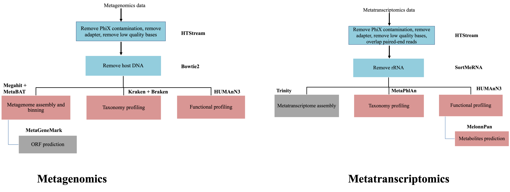

# Exploration in Integrating metagenomic and metatranscriptomic data
-------------------------------------------------------

  

    
  

## Differential abundance analysis of metatranscriptomics data adjusting for DNA abundance

As we have noticed that the quantification with HUMAnN3 using metagenomics data and metatranscriptomics show significant differences. Why? First, let's take a step back and think about what we are measuring using these two techniques. Metagenomics is to sequencing DNA material, which most cells only have one copy of. Therefore, what we measurement using metagenomics data is actually the number of microorganism cells we see in our samples. On the contrary, gene expression levels could be wildly different from gene to gene and most of the genes have multiple copies of RNA expressed in one cell. This means that what metatranscriptomics is measuring is the total number of RNA expressed from the same species. The contributing factors to the measured expression level come from two sources: the number of microorganism cells and the expression levels of the gene from each cell. So, we should be very careful in interpreting the differential abundance results when only using metatranscriptomics data, especially at the classification to microorganism level.

In order to truly study the expression regulation the integration of metagenomic data is essential.

Zhang, etc., Bioinformatics 37 (2021), https://doi.org/10.1093/bioinformatics/btab327

####  Start Exercise 1: 

We are going to use the package, [MTX_model](https://github.com/biobakery/MTX_model) to perform differential analysis using the HUMAnN3 gene family results from both the metatranscriptomics analysis and metagenomics analysis. We are going to use the relative abundance for both. Since we have generated the relative abundance table for metatranscriptomics data yesterday, please go ahead and produce the relative abundance table for metagenomics data. Then we will install the package and run the analysis.

####  End Exercise 1: 

## Mapping metatranscriptomics data

The second approach to integrate the two data types is to map metatranscriptomics reads to the MAGs assembled. It could provide some indication on the completeness of the assembled MAGs.

####  Start Exercise 2: 

Use the bowtie slurm script that we have used to remove host DNA as a starting point, create the script to align the rRNA removed RNA reads to the assembled contigs (the bowtie2 index have prefix of "/share/biocore/projects/Internal_Jessie_UCD/Workshops/Metagenomics_and_Metatranscriptomics/03-Megahit-DNA/${SAMPLE}/${SAMPLE}.contigs"). After the mapping is finished, please take a look at the mapping rate.

####  End Exercise 2: 

