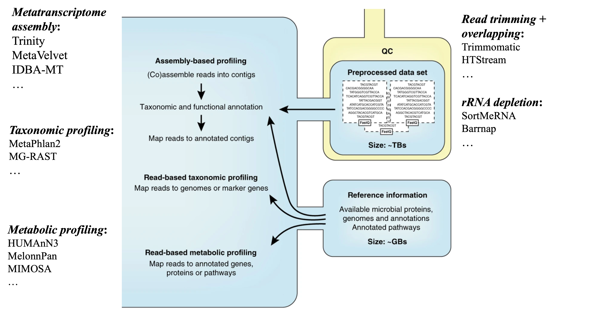
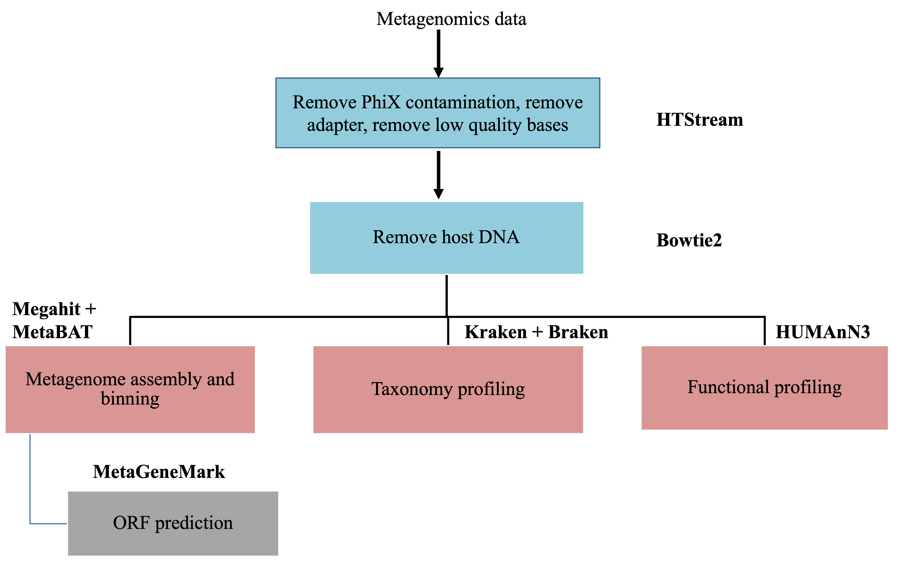

# Overview on metagenomics and metatranscriptomics
-------------------------------------------------------

Vanwonterghem, etc., 2014, Curr. Opin. Biotechnol.

Microbiomes are ubiquitous in the environment and play essential roles in every aspects of nature and life. Despite its importance, the research on the mcirobial community was severely limited because of the difficulty in cell culturing and separation. In recent years, more effort has been put in studying these microorganisms, facilitated by advances in technology, especially the sequencing technologies, and the significant decrease in the cost.

In microbial studies, the three questions that one may try to answer are: who is there (taxonomy profiling), what do they do (functions), and how do they change. Five approaches can be used to answer these questions: metagenomics, metatranscriptomics, metaproteomics, microbial metabolomics, and image based cell activity studies. Metagenomics is a tool to provide taxonomy profiling. When shotgun sequencing is used, it can also provide the information on the potential functions of the microbial members. Metatranscriptomics is a tool that can not only provide the taxonomy information, but also what the microbes are doing/expressing. Metaprotomics and microbial metabolomics are mass spectrometry based tools to study the phenotypes of the microorganicsms on the molecular level. Image based cell activity studies apply stable/radioactive isotope labeling to visualize the activities of microbial cells. In this workshop, we are going to focus on the sequencing bases approaches: metagenomics and metatranscriptomics.

---

## Metagenomics

The field of metagenomics is to study the composition of the microbial communities. There are two approaches available in this field:

* Amplicon sequencing. It only sequences rRNA related genomic materials, such as the most popular 16S target sequencing, and ITS target sequencing for fungal genomes.
  * lower per sample cost. Using Illumina platform, capable of pooling thousands, or even tens of thousands of barcoded samples/targets per sequening run
  * taxonomy profiling, highly dependent on the completeness of existing databases
  * It has been demonstrated that the universal PCR primers traditionally used for PCR amplification of the segments of the 16S rRNA genes are not actually universal and thus fail to fully represent the community's composition. (Fuks, etc., Microbiome, 2018 Jan 26; 6(1):17.)

* __Shotgun-based sequencing. It allows for sequencing of full DNA materials from all organisms within a community.__
  * taxonomy profiling
  * metagenomic assembly and binning
  * identify potential functions
  * discovery of unknown microorganisms

 
Shotgun-base metagenomics approach has the advantage of producing not only the composition of the community, but also provide information on potential functions from all organisms present in a given complex sample. It allows the discovery of previously unknow species even when they could not be classified to known taxa.

Quince, C., etc., 2017, Nat. Biotechnol.

For each of the steps along the metagenomics data analysis using shotgun sequencing, many tools have been developed or adapted from regular genomics data analysis.

---

## Metatranscriptomics

Metatranscriptomics is to use RNASeq technology to profile expressed genes in a microbial community. It allows for the profiling of the composition of the community as well as the activities of the community from gene expression point of view. By mapping the expressed genes to metabolic pathways, it presents a picture of the functional aspect of the microbial community. It distinguishes an active member from a non-active member. In addition, it offers a tool to study the responses that the microbial community has to their changing environmental conditions.

modified from: Quince, C., etc., 2017, Nat. Biotechnol.

The analysis of metatranscriptomics borrow some tools from the analysis of metagenomics. For example, for assemblying the metatranscriptome, the assembly tools that were initiall designed for metagenomics have been used frequently. It also borrows some tools from the regular transcriptomic assembly, such as Trinity, which has been shown to improve the number of annotated genes from the assembled transcripts. There are a few tools designed specifically for metatranscriptomes and take into account the unique features of both transcripts and the complex nature of microbial communities, such as IDBA-MT, TAG.

---

## Data Analysis Workflows

    

        
        
Metagenomics

    

    

        
        
Metatranscriptomics

    

    

        
        
Metagenomics

    

    

        
        
Metatranscriptomics

    

---

